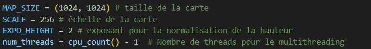

# Génération de Map avec Multi-processing

## Introduction

Ce projet implémente la génération de cartes en utilisant des techniques de multi-threading et de pour améliorer les performances. Il inclut également des algorithmes pour calculer le chemin le plus court dans une carte générée.

## Fonctionnalités

- **Génération de cartes :**
  - Génération classique (mono-thread).
  - Génération optimisée avec multi-processing, permettant une accélération significative en utilisant plusieurs cœurs du CPU.

- **Calcul du chemin le plus court :**
  - Version classique.
  - Version avec multi-processing.

- **Exportation :**
  - Exportation des cartes générées, avec ou sans chemin le plus court, optimisée pour gérer de grandes cartes (exemple : 2048 x 2048).

- **Explosion :**
    - Faire exploser des endroits de la map 

## Comparatif des performances

### Génération de carte
## Pour réaliser nos comparatif on va prendre une map de (1024 x 1024)

- **Sans multi-threading :**
  -  159.9 secondes.

- **Avec multi-threading :**
  - 34,9 secondes

### Calcul du chemin le plus court
- **Sans multi-threading :** Résultats rapides pour des cartes avec peu de points à calculer.
- **Version multi-processing :** Moins efficace lorsque peu de calculs sont nécessaires, mais corrigé avec des optimisations pour synchroniser les processus.

## Architecture et Implémentation

1. **Génération de cartes :**
   - Découpe de la matrice en plusieurs blocs (`chunks`).
   - Calcul parallèle dans chaque bloc.
   - Fusion des résultats pour reconstituer la carte complète.

2. **Calcul du chemin le plus court :**
   - Algorithme adapté pour chercher un chemin unique.
   - Gestion améliorée de la synchronisation des threads/processus.

3. **Améliorations :**
   - Menu enrichi pour sélectionner différentes versions des algorithmes.
   - Optimisations spécifiques pour grandes cartes.

